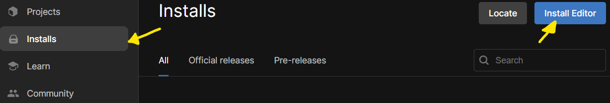

# Installing

### Unity
Firstly, we'll need Unity, (big shocker wow), to do that, we'll head right over to downloading [**Unity Hub**](https://unity.com/download), and click on 'Download for Windows', if you are using Mac, gtfo.

Now that the weirdos are gone, we have to sign in. Do that with google or whatever the f*ck you want. Just accept the terms and conditions (you are selling your soul but its fine, we're getting sent into the cuphead universe).

 We're going to install Unity, again, you see, we installed Unity Hub before, not Unity. Basically Unity Hub is just something that gives us access to the different versions, and some templates. We're using Unity 6.2(**6000.0.57f1**) if it doesn't have this automatically showing up, click skip installation, head over to installs on the left. Click the blue 'Install Editor' button, and select **6000.0.57f1**. 
 

 We don't need to select any of the checkboxes, and deselect the Visual Studio Community, we'll be using Visual Studio Code. VSC instead of VSC isn't it obvious? If you think you will be working offline for a significant amount of time, you can choose to install the documentation down on the bottom, otherwise, its available online.

### Visual Studio Code
 Wait. It'll take a minute or five. In the mean time, we'll install Visual Studio Code, you should all have it installed actually.

### Github Desktop
You also have this right? And we don't need it yet really.

### Back on track
Has Unity finished installing yet, if not, touch grass, otherwise let's continue.

